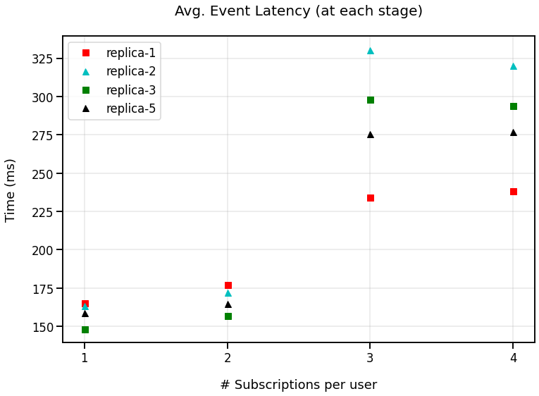
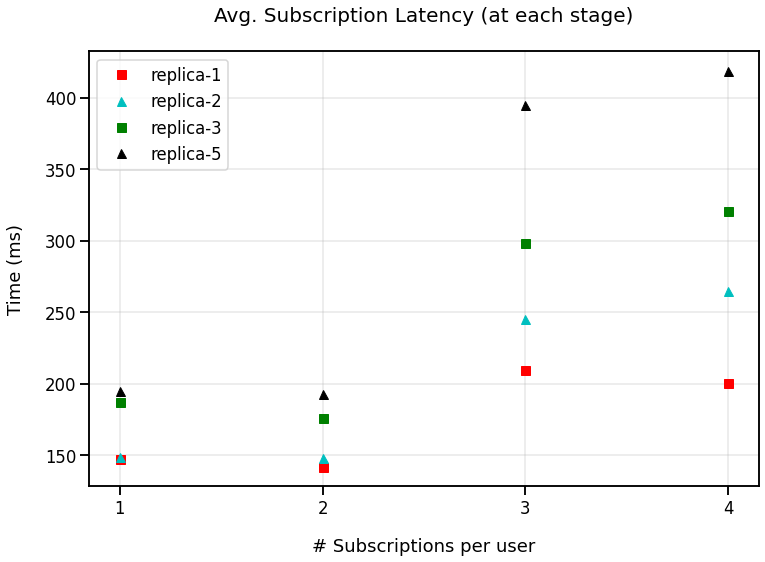
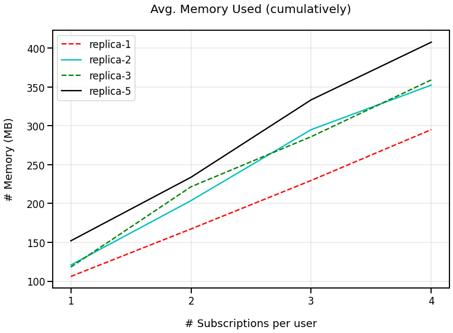
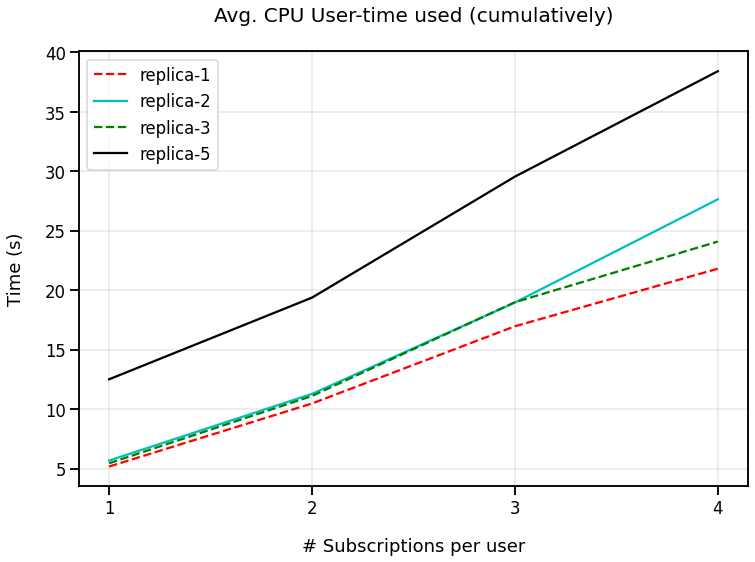

## Metric Results - 75 nodes
Here we show graphics relative to CPU, memory and event latency metrics of our pubsub middleware Redirect-Reliable variant. The experience was built to provide a clear view of the impact of how the increase in he replication factor is evolves with the system's performance. The same is also done with the amount of subscriptions in the system. This results were collected from a testground environment with 48 nodes:
- Executed on: ubuntu VM with 126GB RAM and 16 cores CPU.
- Latency between peers: 10ms

### Experience
In each run we have 48 pubsub instances, configured with a certain faulttolerancedfactor f (replica-f). A run is devided in 4 stages, each of them containing a subscription and publishing routine. In each subscribing routine 1 subscription is added per sub, and in each publishing one a event is published by a pub (5 in total). Although the number of events is always the same, ther may be more or less interested subscribers, meaning that performance is not linear.


```python
import process_run

process_run.final_plot()
```


    

    


    


    

    


    


    

    


    


    

    

