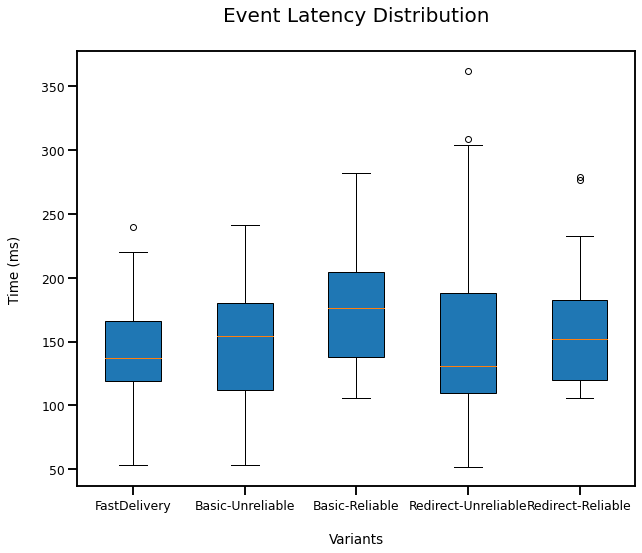
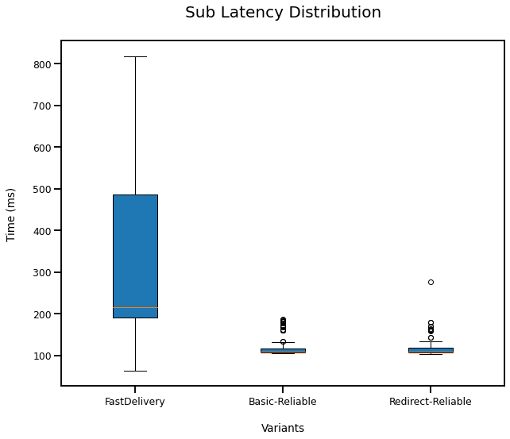

## Metric Results - 30 nodes
Here we show graphics relative to CPU, memory and event latency metrics of our pubsub middleware in different scenarios. This results were collected from a testground environment with 30 nodes:
- Executed on: ubuntu VM with 12GB RAM and 6 cores.
- Latency between peers: 10ms
- Number of runs per variant/scenario: 3

Notes:
- max measures of cpu and memory are used to detect runs that suffered external noise from outside processes.
- the FastDelivery just as a scenario because of its pub-centralized nature.
- correctness metrics are the sum of all runs.
- a miss at FastDelivery means that he failed to find the Advertising board or failure of event receiving, while at ScoutSubs only the latter. Duplicated events means that event has already been received by sub.

### Normal Scenario
3 publishers publishing a event and the rest are suscribing, each one to two predicates.


```python
import process_run

process_run.plot_everything("normal")
```


    

    


    

    


    

    


    

    


    

    


    


    

    


    


### Subscription Burst Scenario
The first subscription round here is identical to the normal scenario, but at the publishing scenario the subscribers will make new subs as the 3 publishers publish their events. This subs are irrelevant for the event delivery, the objective is to overload the system a bit.


```python
import process_run

process_run.plot_everything("subBurst")
```


    

    


    

    


    

    


    

    


    

    


    


    

    


    


### Event Burst Scenario
The subscription round here is identical, but this time the same subscribers will publish events. From only 15 subs and 3 pubs (normal scenario) to 15 subs and 15 pubs.


```python
import process_run

process_run.plot_everything("eventBurst")
```


    

    


    

    


    

    


    

    


    

    


    


    

    


    


### Fault Tolerance Scenario
Here we have a scenario similar to the normal, but this time between the subscription round and the publishing round a node fails (a rendezvous one).


```python
import process_run

process_run.plot_everything("fault")
```


    

    


    

    


    

    


    

    


    

    


    


    

    


    


### Long Run Scenario
Here we have a scenario similar to the normal at a first stage but then we have a stage between refreshing cycles were we some nodes unsubscribing and others failing. Then after a refreshing cycle takes place the publishers will publish similar events again.


```python
import process_run

process_run.plot_everything("longrun")
```


    

    


    

    


    

    


    

    


    

    


    


    

    


    

